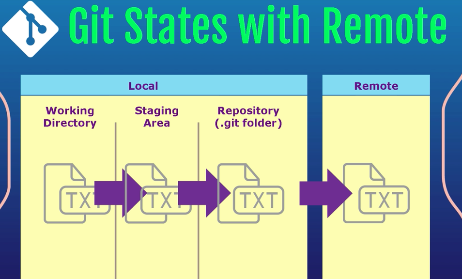

1 - cd to directory
  - make sure you have created a .gitignore file
2 - git init
3 - ls -al
4 - Create a repo and copy URL
5 - We need to sync our remote repo to our local repo
6 - run: git remote add origin (URL.....)
7 - git status
8 - git add .
9 - git status
10 - git commit -m "....."
11 - git push origin master
12 - refresh github page


# Setting up the _____ project


## Creating a branch from master
	git clone --branch master
  * Ex: https://github.com/RichardLitt/the-travel-shelf.git

## Adding the directory to the project with git
  git add app

## To stage files for tracked files for a commit
	git commit -m "Initial commit”

## Create new branch on github website based on master

## Pull changes from remote
	git pull

## To switch to another branch:
	git checkout homepage

## When ready to finish my work,
	1st- merge changes from origin master
	git pull

	git merge origin/master


## Now, I need to make my origin page branch current by pushing these changes from local to it:
	   git push

Now, that homepage branches (local & origin) are in sync with the master branch,
I can open my pull request in github.

On Branch homepage, I made changes to index.html, then ran in terminal:

	git status
	git add .  (for all)
	git commit -m "Added navbar and Hero section"
	git push


### Info:

Created index.html and added navbar and hero section

	1.	Rename your local branch. If you are on the branch you want to rename: git branch -m new-name. ...
	2.	Delete the old-name remote branch and push the new-name local branch. git push origin :old-name new-name.
	3.	Reset the upstream branch for the new-name local branch. Switch to the branch and then: git push origin -u new-name.

Created index.html and added navbar and hero section

  git merge origin/master
  git pull
  git merge origin/master
  git status
  git push
  git status
  git pull
  git merge origin/master
  ls -al
  git branch


# **************** GIT COURSE ****************


  

  `git init demo` (creates folder and initializes an empty Git repository)
  Initialized empty Git repository in /Users/joannakatsifaraki/src/Coding/projects/demo/.git/

  or
  `git init .`  (init in the current folder)

  ls -al
total 0
drwxr-xr-x   3 joannakatsifaraki  staff  102 30 Oct 14:28 .
drwxr-xr-x   3 joannakatsifaraki  staff  102 30 Oct 14:28 ..
drwxr-xr-x  10 joannakatsifaraki  staff  340 30 Oct 14:28 .git

run: pico README.md
Modify the file by adding info. Run:

  Save

  `git status`

  `git add README.md`

  `git status`

  `git commit -m "First file in demo repo"``

  `git status`
On branch master
nothing to commit, working tree clean

  `pico LICENSE.md`
  (creates file and opens it in pico)

-*** NOTE *** -
  If you run: git commit
  (it will have the core editor open with git which is VIM)

  *** Quickly Quit VIM with Write & Save to File
  Hit ESCAPE key, then SHIFT + ZZ

  `git log`
    git responds with all the commits that are responsible for this repository
    - we see the commit id, author, date, and commit message

  `git show`
    shows the last commit and a diff containing all the changes

  `git ls-files`
    git tells me what files are being tracked

  ## EXPRESS git command:

  `git commit -am "......" `
    -a tells Git to first add modified files to the Git staging area and then directly proceed to committing (I'm adding the modifications to the staging area and then committing those changes)
    m for message

  ## To Unstage

  After a modification in a file, do a
  git status

  git add .

  ## To undo the changes:

  git reset HEAD README.md
    Unstaged changes after reset:
    M	README.md

  *** If we open the file with the modifications, we see that the modification still exists, just that it has been unstaged.

  ### To revert back and discard the changes entirely run:
  git checkout -- README.md (name of file)

  test it => `git status`

  On branch master
  nothing to commit, working tree clean
  **open file to view and we see that all changes are gone**

  ## Making new commands with Alias

  `git log`
  to see all commits

  `git help log `

## Log command:

  `git log --oneline --graph --decorate --all`

  --oneline
  provides a lot of info on one line
  --graph
  which will provide an asterisk based graph denoting our branching hierarchy
  --decorate
  which tells us which commits are a part of which branches
  --all
  provides the history for all the branches that are available in this repository

  ### It's like a git history
  ```
  * ed479d1 (HEAD -> master, origin/master) Added notes
  * ed76111 Added additional notes to git notes and an image
  * 3fd2e49 Added files and updated notes
  * b57bddf Includes git notes
  * 0617cbf Initial commit
```

## Create Git Alias
###To create a history command because Git does not have one.

Which is a short representation of a longer command.

git config --global alias.hist "log --oneline --graph --decorate --all"

`.hist` => is the name you want to use for your new commands
"log --oneline --graph --decorate --all" => double quotes what command you want to use, leaving out the word `git`

## Double check this entry
  `git config --global --list`

user.name=Joanna
user.email=morningstarjk@hotmail.com
filter.lfs.process=git-lfs filter-process
filter.lfs.required=true
filter.lfs.clean=git-lfs clean -- %f
filter.lfs.smudge=git-lfs smudge -- %f
alias.hist=log --oneline --graph --decorate --all

- We see in the end of the above the alias.hist =

Test the Alias :
`git hist`
  * If it worked, you should have the same output as the "log" command we did previously*

* 58239f0 (HEAD -> master) Updating README.md
* 5308926 Adding a LICENSE file to the repo
* 752ac63 First file in demo repo

  `git hist -- LICENSE.md`
        => git hist -- filename
  * 5308926 Adding a LICENSE file to the repo

  => the hist alias will pass the -- filename to the underlying "git log" command
  pertaining only to the "LICENSE.md" file.
